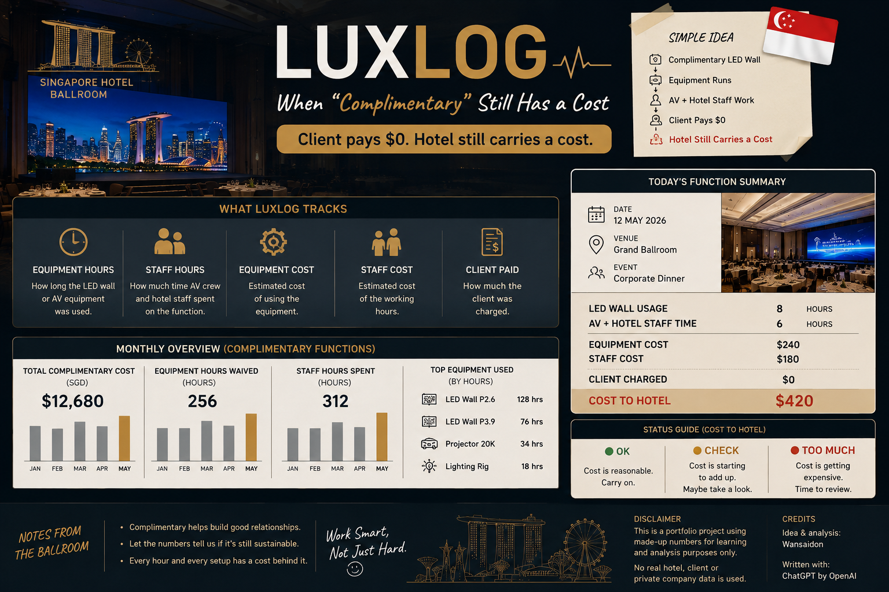

# 📽️ LuxLog — When "Complimentary" Still Has a Cost

> **Client gets the LED wall complimentary. Invoice says $0.  
> But equipment still runs and hotel staff still work. So really free meh?** 😂

LuxLog is a simple data project based on **hotel ballroom events**.

Sometimes AV equipment like an **LED wall** is given complimentary to a client.

Client pays:

**$0**

But behind the scenes, there is still a cost.

---

## 🏨 What Happens Behind the Ballroom Doors?

For one function:

**📽️ LED wall gets used**

**👷 AV crew sets it up**

**🏨 Hotel staff support the function**

**⏱️ Staff spend time**

**🔧 Equipment gets wear and tear**

**🧹 Everything still needs to be packed down**

So even when the client gets it complimentary:

> **Someone still has to do the work.**

One free setup? Maybe okay.

Every other function also free?

**Eh... better check already.** 😂

---

## 📊 What Does LuxLog Track?

Simple things:

**📽️ Equipment Hours** — How long was it used?

**👷 Staff Hours** — How much time was spent?

**💵 Equipment Cost** — What did the equipment usage cost?

**💵 Staff Cost** — What did the working hours cost?

**🧾 Client Paid** — How much was charged?

Then LuxLog asks:

> ## **Client paid $0. What did it actually cost us?**

---

## 🤔 Does That Mean Don't Give Free?

No lah. 😂

Sometimes complimentary equipment makes sense.

Maybe it's part of a package.

Maybe it's an important client.

Maybe it's service recovery.

Maybe Sales got a deal to close.

The point isn't:

> **"Don't give anything free."**

It's:

> **"Know what you're giving away."**

Then the hotel can decide whether it's worth it.

---

## 🚦 Keep It Simple

**🟢 OK** — Cost is reasonable.

**🟠 CHECK** — Cost is adding up.

**🔴 TOO MUCH** — Time to review.

No need 25 charts and one meeting that could have been an email. 😂

---

## 🧠 The Simple Idea

**Ballroom function → Complimentary LED wall → Equipment gets used →
Staff work → Client pays $0 → Hotel still carries a cost**

That's LuxLog.

> **Complimentary for the client doesn't mean zero cost for the hotel.**

---

---

## 🐍 Python Version

[View `luxlog.py`](luxlog.py)

---

## ⚖️ Disclaimer

This is a portfolio project inspired by hotel ballroom operations.

All numbers are made up. No real hotel, client or private company data is used.

---

## ✍️ Credits

**Idea & analysis:** Wansaidon  
**Written with:** ChatGPT by OpenAI

---

> **Client sees $0. LuxLog looks at what happened behind the scenes.**
