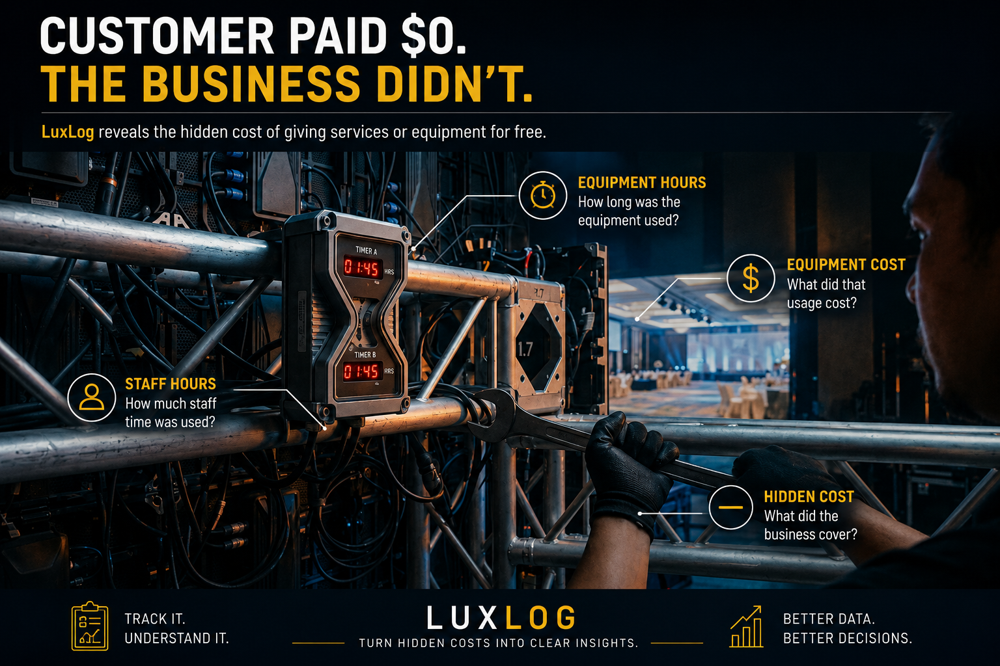

# 📽️ LuxLog --- When "Free" Isn't Really Free

> **The customer pays \$0. But the equipment still runs and the staff
> still work. So how much did "free" actually cost?**

LuxLog is a simple data project about something businesses sometimes
overlook:

**The hidden cost of giving services or equipment for free.**

------------------------------------------------------------------------

## 🤔 What's the Problem?

Imagine a customer gets an LED wall for free.

The bill says:

> **\$0**

Nice.

But the LED wall was still used.

Someone still had to set it up.

Staff still spent time working on it.

And every piece of equipment eventually needs repair or replacement.

One free setup?

Probably fine.

Keep doing it again and again?

**Now the cost starts adding up.**

------------------------------------------------------------------------

## 📊 What Does LuxLog Track?

**⏱️ Equipment Hours**\
How long the equipment was used.

**👷 Staff Hours**\
How much time staff spent on the setup.

**🔧 Equipment Cost**\
The estimated cost of using the equipment.

**💵 Staff Cost**\
The estimated cost of the staff time used.

**🧾 Customer Paid**\
How much the customer was charged.

**📉 Total Cost**\
How much the business may have to cover.

Nothing fancy.

Just answering:

> **We charged \$0. What did it actually cost us?**

------------------------------------------------------------------------

## 🔍 What Can We Analyse?

LuxLog can help us ask:

**How many free setups are happening?**

**How many hours is the equipment being used for free?**

**How much staff time goes into them?**

**Which equipment gets used the most?**

**How much could each free setup be costing?**

**Which month has the most free usage?**

**Is free usage increasing over time?**

And the most important question:

> **Are free setups actually a problem?**

We don't assume the answer.

Maybe the cost is small and everything is fine.

Maybe the cost is growing and needs attention.

**Let the data tell the story.**

------------------------------------------------------------------------

## 🚦 Keep It Simple

### 🟢 OK

Costs are still reasonable.

**Carry on.**

### 🟠 CHECK

Costs are starting to increase.

**Maybe take a look.**

### 🔴 TOO MUCH

Free setups are costing more than expected.

**Time to review.**

No need for 25 charts and one meeting that could have been an email. 😂

------------------------------------------------------------------------

## 💡 Should We Stop Giving Things for Free?

No.

Sometimes giving something for free makes sense.

Maybe it keeps an important customer happy.

Maybe something went wrong and the business wants to make things right.

Maybe it's simply good service.

The point isn't:

> **"Don't give anything free."**

The point is:

> **"Know what you're giving away."**

Then people can decide whether it's worth it.

------------------------------------------------------------------------

## 🧠 The Whole Project in One Line

> **Customer pays \$0 → Equipment gets used → Staff spend time →
> Business still has a cost**

LuxLog simply makes that cost easier to see.

------------------------------------------------------------------------

## 🛠️ How I Analyse It

**1. Ask a question**

What are we trying to find out?

**2. Check the data**

What information do we have?

**3. Clean it**

Fix missing, repeated or incorrect information.

**4. Analyse it**

Look for patterns and changes.

**5. Show the results**

Make the findings easy to understand.

**6. Make a recommendation**

Explain what the numbers suggest we should look at.

The dashboard isn't the end goal.

> **Understanding what the numbers are telling us is.**

------------------------------------------------------------------------

## 🐍 Python Version

A simple Python version is included:

[View `luxlog.py`](luxlog.py)

------------------------------------------------------------------------

## ⚖️ Disclaimer

This is a portfolio project using made-up numbers. No real company or
private data is used.

## ✍️ Credits

**Idea & analysis:** Wansaidon\
**Written with:** ChatGPT by OpenAI

------------------------------------------------------------------------

> ## **Free for the customer doesn't always mean free for the business.**

*LuxLog makes that cost easier to see.*